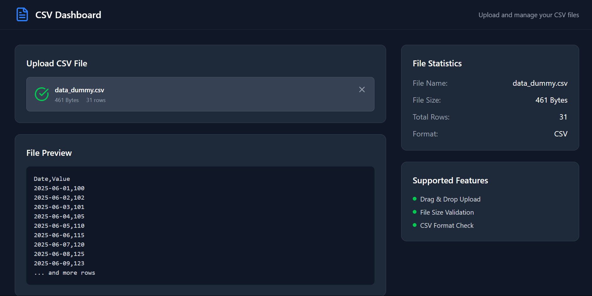

# new-frontend



A Vite + React + Tailwind CSS project.

## Quick Start

### 1. Install Dependencies
```sh
npm install
```

### 2. Start Development Server
```sh
npm run dev
```

### 3. Build for Production
```sh
npm run build
```

---

## Tailwind CSS Setup

This project uses Tailwind CSS. If you see **blank HTML with no styles**, make sure you have these files in your project root:

- `tailwind.config.js`
- `postcss.config.js`

If missing, create them:

#### `tailwind.config.js`
```js
module.exports = {
  content: [
    './index.html',
    './src/**/*.{js,ts,jsx,tsx}',
  ],
  theme: {
    extend: {},
  },
  plugins: [],
}
```

#### `postcss.config.js`
```js
module.exports = {
  plugins: {
    tailwindcss: {},
    autoprefixer: {},
  },
}
```

---

## Troubleshooting

- **Blank HTML, no styles:** Ensure Tailwind config files exist and are correct. Restart the dev server after changes.
- **Editor warning `Unknown at rule @tailwind`:** Install the [Tailwind CSS IntelliSense](https://marketplace.visualstudio.com/items?itemName=bradlc.vscode-tailwindcss) extension for VS Code, or add this to `.vscode/settings.json`:
  ```json
  { "css.lint.unknownAtRules": "ignore" }
  ```
- **Still not working?**
  1. Delete `node_modules` and `package-lock.json`
  2. Run `npm install`
  3. Restart the dev server

---

## Requirements
- Node.js (v18+ recommended)
- npm

---

## Project Structure
- `src/` — Main source code
- `src/index.css` — Tailwind CSS entry
- `src/main.tsx` — App entry point

---

## Useful Links
- [MUI x](https://mui.com/x/introduction/installation/)
- [Tailwind CSS Docs](https://tailwindcss.com/docs/installation)
- [Vite Docs](https://vitejs.dev/guide/)
